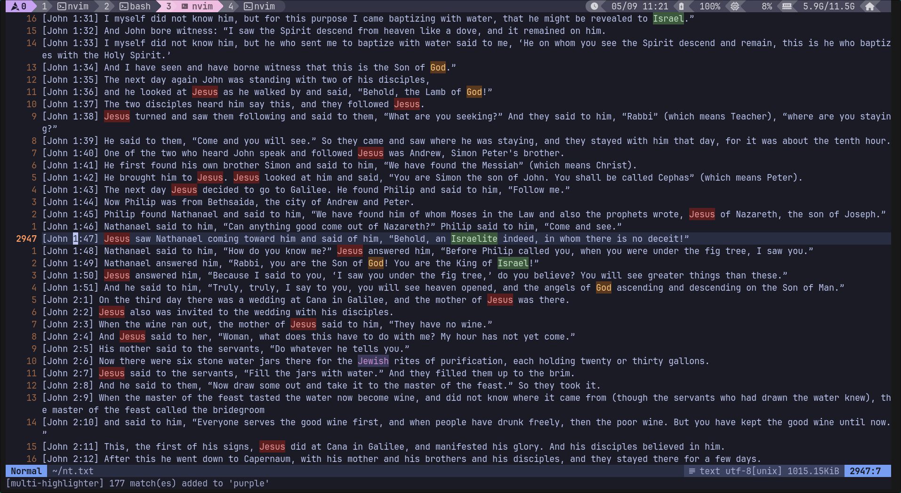

# multi-highlighter.nvim

Multiple simultaneous buffer highlights with category management.

Ever wanted to keep several `hlsearch`-style highlights active at once — one for `TODO`, another for `FIXME`, a third for whatever grep result you just yanked? That's what this plugin does.

Each **category** gets its own colour and a set of highlighted ranges that persist until you clear them.

---



---

## Features

- Unlimited named highlight categories, each with a distinct colour
- Highlight by **range** (`"42"`, `"42,5-44,12"`) or by **Vim regex pattern** (`/TODO/g`)
- `add` (accumulate) or `set` (replace) semantics per category
- Send matches to the **quickfix** or **location list**, optionally filtered by category
- Full **tab-completion** for sub-commands, category names, and option keys
- Pre-define persistent categories in your config; or create ad-hoc per-session ones
- Lua API for use by LSPs, scripts, or other plugins

---

## Installation

### lazy.nvim

```lua
{
  "MasterTemple/multi-highlighter.nvim",
  config = function()
    require("multi-highlighter").setup({
      categories = {
        todo  = { bg = "#5c3a1e", fg = "#ffcc80", bold = true },
        notes = { hl_group = "DiffAdd" },
      },
    })
  end,
}
```

### packer.nvim

```lua
use {
  "MasterTemple/multi-highlighter.nvim",
  config = function()
    require("multi-highlighter").setup({})
  end,
}
```

No setup call is needed — the plugin auto-initialises with defaults if you omit it.

---

## Commands

All arguments support `<Tab>` completion.

### `:Hl add <category> <range>`

Add line/column ranges to a category.

| Format | Meaning |
|--------|---------|
| `N` | whole line N (1-indexed) |
| `N,C` | character at line N, column C |
| `N,C1-M,C2` | from line N col C1 to line M col C2 |

```vim
:Hl add todo 42
:Hl add todo 42,5-42,12
```

### `:Hl add <category> /pattern/[flags]`

Add all Vim-regex matches in the current buffer.

```vim
:Hl add todo /TODO/g
:Hl add fixme /FIXME\|HACK/
```

### `:Hl set <category> <range|/pattern/>`

Clear existing matches for the category, then add.

### `:Hl clear [category ...]`

```vim
:Hl clear           " clear everything
:Hl clear todo      " clear one category
:Hl clear todo fixme
```

### `:Hl category [name [key=value ...]]`

Define or redefine a category's appearance.

```vim
:Hl category                          " list all categories
:Hl category search1                  " create with auto colour
:Hl category search1 bg=#3d5a3e fg=#c8e6c9 bold=true
:Hl category results hl_group=Search  " link to existing group
```

**Option keys:** `fg`, `bg`, `hl_group`, `bold`, `italic`, `underline`

### `:Hl qflist [category ...]`

Send all (or selected) category matches to the quickfix list and open it.

```vim
:Hl qflist
:Hl qflist todo fixme
```

### `:Hl loclist [category ...]`

Same but uses the location list of the current window.

---

## Lua API

```lua
local mh = require("multi-highlighter")

-- Define / redefine a category
mh.define_category("errors", { bg = "#5c1e1e", fg = "#ef9a9a", bold = true })

-- Highlight ranges
mh.add_range("errors", "10")
mh.add_range("errors", "20,3-20,15")
mh.set_range("errors", "42")          -- clears first, then adds

-- Highlight patterns (Vim regex)
mh.add_pattern("todo", "TODO\\|FIXME")
mh.set_pattern("todo", "TODO")        -- clears first

-- Clear
mh.clear("todo")
mh.clear_all()

-- Category list
local names = mh.get_categories()     -- string[]

-- Fill lists
mh.populate_qflist({ "todo", "fixme" })   -- nil = all
mh.populate_loclist(nil)
```

---

## Configuration

```lua
require("multi-highlighter").setup({
  -- Colour palette cycled for auto-assigned categories.
  palette = {
    { bg = "#3d5a3e", fg = "#c8e6c9" },  -- green
    { bg = "#3b3a5c", fg = "#ce93d8" },  -- purple
    { bg = "#5c3a1e", fg = "#ffcc80" },  -- orange
    { bg = "#1e3a5c", fg = "#90caf9" },  -- blue
    { bg = "#5c1e1e", fg = "#ef9a9a" },  -- red
    { bg = "#3a3a1e", fg = "#fff176" },  -- yellow
    { bg = "#1e4a4a", fg = "#80cbc4" },  -- teal
    { bg = "#4a1e3a", fg = "#f48fb1" },  -- pink
  },

  -- Pre-defined categories (available immediately without :Hl category)
  categories = {
    todo  = { bg = "#5c3a1e", fg = "#ffcc80", bold = true },
    fixme = { bg = "#5c1e1e", fg = "#ef9a9a" },
    note  = { hl_group = "DiffAdd" },
  },
})
```

---

## Tips

**Highlight the word under the cursor into a category:**

```lua
vim.keymap.set("n", "<leader>h1", function()
  require("multi-highlighter").add_pattern("hl1", vim.fn.expand("<cword>"))
end)
```

**Cycle through categories with key bindings:**

```lua
local cats = { "hl1", "hl2", "hl3" }
for i, cat in ipairs(cats) do
  vim.keymap.set("n", "<leader>h" .. i, function()
    require("multi-highlighter").add_pattern(cat, vim.fn.expand("<cword>"))
  end)
  vim.keymap.set("n", "<leader>H" .. i, function()
    require("multi-highlighter").clear(cat)
  end)
end
```

**Integration with an LSP diagnostic handler:**

```lua
-- Highlight all errors reported by LSP into the "errors" category
vim.api.nvim_create_autocmd("DiagnosticChanged", {
  callback = function()
    local mh = require("multi-highlighter")
    mh.clear("lsp_error")
    for _, diag in ipairs(vim.diagnostic.get(0, { severity = vim.diagnostic.severity.ERROR })) do
      mh.add_range("lsp_error", string.format("%d,%d-%d,%d",
        diag.lnum + 1, diag.col + 1, diag.end_lnum + 1, diag.end_col + 1))
    end
  end,
})
```

---

## Provenance

Thanks Claude 🫡
